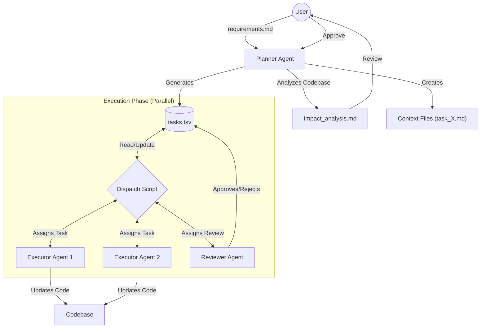

# Multi-Agent Development Workflow (Plan-First)

## License
MIT License. See [LICENSE](./LICENSE) for details.

This directory contains the tools and templates for a high-efficiency, "Plan-First" multi-agent development workflow. This system is designed to allow multiple AI agents (e.g., in Cursor Composer) to work in parallel on a shared backlog of tasks without constant user micro-management.

## 🌊 Workflow Overview

The core philosophy is **Planning before Execution**. A "Planner" agent breaks down the work into atomic tasks with explicit dependencies. "Executor" and "Reviewer" agents then autonomously consume these tasks from a shared `tasks.tsv` file/database.

### Architecture



## 🚀 How to Execute

### 1. Phase: Planning

1.  **Prepare Requirements**: Create a markdown file (e.g., `requirements.md`) detailing the feature spec, design links, and business rules.
2.  **Generate Prompt**: Run the CLI or script to create the planner prompt.
    *   **CLI**: `python3 scripts/swarm_cli.py` -> Option 1 -> Planner
    *   **Script**:
    ```bash
    ./scripts/generate_prompt.sh --agent planner --role planner --requirements requirements.md --n-agents 3
    ```
3.  **Instruct**: Copy the output and paste it into a new chat window (Recommended: **Claude 3.5 Sonnet** or **Opus**).
4.  **Review**: The planner will generate an `impact_analysis.md`. Review this document.


### 2. Phase: Setup Agents

You need to "program" your agents to follow this workflow. We provide a generator script that injects the correct absolute paths for your environment.

**Generate Prompts:**

*   **CLI**: `python3 scripts/swarm_cli.py` -> Option 1 -> Executor / Reviewer
*   **Script**:
    ```bash
    ./scripts/generate_prompt.sh --agent agent_1 --role executor
    ./scripts/generate_prompt.sh --agent reviewer_1 --role reviewer
    ```

*Copy the output and paste it into the respective agent's chat window.*

### 3. Phase: Autonomous Execution

Once initialized with the prompt, the agents will enter a loop:
1.  **Fetch**: They run `./scripts/get_next_task.sh` to find their next job.
2.  **Work**: They read the `task_{id}.md`, write code, and run tests.
3.  **Submit**: They mark the task as `in_review`.
4.  **Repeat**: They immediately ask for the next task.

**Your Role**:
*   Monitor the `tasks.tsv` file (or use `./show_progress.sh` if available).
*   Watch the agents work.

## 💻 Swarm CLI
We provide an interactive CLI tool to manage the entire workflow easily.

```bash
# Launch the main menu
python3 scripts/swarm_cli.py
```

Menu Options:
1.  **Generate Agent Prompt**: Setup Planner, Executor, or Reviewer roles.
2.  **Show Progress**: Visualize milestones, active agents, and bottlenecks.
3.  **Toggle Pause/Resume**: Global kill-switch for the swarm.
4.  **Update Task Status**: Manually intervene on specific tasks.

---

## 🛠 Advanced / Manual Tools

### Monitoring Progress (Direct Script)
```bash
# Show summary (Milestones, Active Agents, Blockers)
./scripts/show_progress.sh

# Show detailed lists (Recent Done & Next To-Do)
./scripts/show_progress.sh --verbose
```

### Pausing the Swarm (Direct Script)
If you need to stop all agents (e.g., to fix a bug in the plan or re-prioritize):
```bash
# Pause all agents
./scripts/toggle_pause.sh on

# Resume all agents
./scripts/toggle_pause.sh off
```

### Manual Task Management (Direct Script)
If an agent gets stuck or you need to intervene:
```bash
# Force update a task status
./scripts/update_task_status.sh {TASK_ID} {STATUS}
# Example: ./scripts/update_task_status.sh 1.1.1 to_do
```

## 📂 File Structure

*   `tasks.tsv`: The implementation database. Tracks status, assignments, and dependencies.
*   `scripts/`:
    *   `get_next_task.sh`: The "brain". Decides which task an agent gets next based on dependencies and role.
    *   `task_manager.py`: Python backend for robust CSV and lock handling.
    *   `generate_prompt.sh`: Helper to create correctly path-referenced prompts.
    *   `toggle_pause.sh`: Global kill-switch.
*   `templates/`:
    *   `planner_prompt.md`: Instructions for the Architect.
    *   `executor_prompt.md`: Instructions for Developers.
    *   `reviewer_prompt.md`: Instructions for QAs.

## 🧩 Task Status Flow

*   `to_do`: Ready to be picked up.
*   `in_progress`: Agent is working on it.
*   `in_review`: Implementation done, waiting for QA.
*   `address_review_feedback`: QA rejected, needs fixing.
*   `done`: Completed and Verified.
